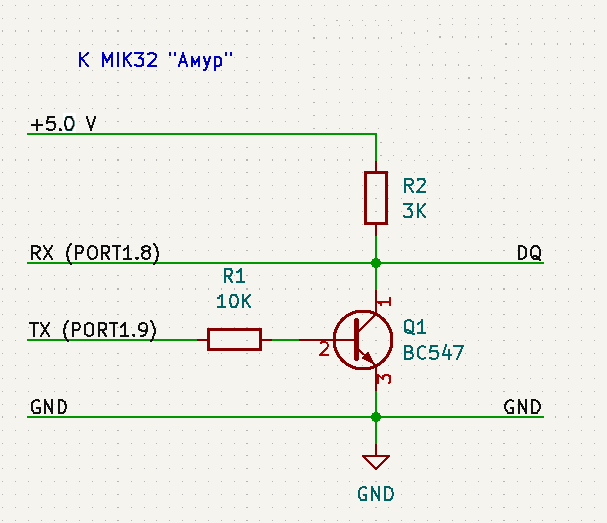

# Пример работы с 1-wire устройствами через UART_1, "дубликатор" ключей.
- По прерыванию от 32-битного (TIMER32_0) таймера переключается светодиод.
- Прерывание от системного таймера увеличивает счётчик миллисекунд.
- UART_1 настраивается на работу с 1-wire протоколом. Почему UART - потому, что не нужно заморачиваться с отсчётом временнЫх интервалов, это делает UART.
- Для подключения к шине 1-wire нужен выход с открытым коллектором. В MIK32 такого нет, так что дополнительно понадобится буферный каскад из двух резисторов и одного транзистора. Если используется NPN транзистор (как в этом примере), то для UART включается инверсия уровней TX. Если использовать "классическую" схему на двух n-канальных полевиках, то инверсию уровней TX включать не нужно.
- Пример выведет в UART_0 приглашение подключить "оригинал" ключа - например, "таблетку" DS1990.
- После успешного чтения ключа в UART_0 будет выведены 8 байтов ключа в HEX виде и приглашение подключить "болванку" (проверялось на RW-1990.1; в примере ещё есть код для записи RW-1990.2, TM-2004 и TM-01, но оно не проверялось).
- После подключения "болванки" производится определение типа и попытка записи с последующей проверкой записанного.
- Результат записи будет выведен опять таки в UART_0.

***

## Схема буферного каскада для этого примера

Обращаю внимание, подключение резистора "подтяжки" к +5В.

***

## Сборка
```
make
```

## Заливка
```
python3 ../tools/elbear_uploader.py ./out.hex --com /dev/ttyUSB0
```

## Заливка с загрузчиком ex_loader_2
```
make upload
```


***

## Дополнительная инфа
- См. "APPLICATION NOTE 214 Using a UART to Implement a 1-Wire Bus Master"
- В devices/test_one_wire_uart.cpp лежит тест алгоритма поиска устройств на шине 1-wire
