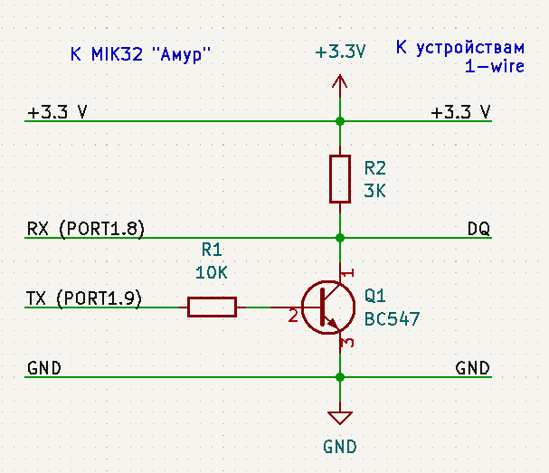

# Пример работы с 1-wire устройствами через UART_1
- По прерыванию от 32-битного (TIMER32_0) таймера переключается светодиод.
- Прерывание от системного таймера увеличивает счётчик миллисекунд.
- UART_1 настраивается на работу с 1-wire протоколом. Почему UART - потому, что не нужно заморачиваться с отсчётом временнЫх интервалов, это делает UART.
- Для подключения к шине 1-wire нужен выход с открытым коллектором. В MIK32 такого нет, так что дополнительно понадобится буферный каскад из двух резисторов и одного транзистора. Если используется NPN транзистор (как в этом примере), то для UART включается инверсия уровней TX. Если использовать "классическую" схему на двух n-канальных полевиках, то инверсию уровней TX включать не нужно.
- Пример в цикле читает идентификаторы подключенных устройств и выводит их в UART_0.
- Если среди устройств найдётся DS18S20 (DS1820) или DS18B20, то после завершения поиска устройств в UART_0 будет выведена схема питания (прямая или "паразитная") и данные о температуре от каждого датчика.
- Внимание: некоторые (может, большинство) DS18B20 с алиэкспресса не работают при "паразитном" питании (мои экземпляры DS18B20 при "висящем" выводе VDD подсаживали DQ до 1.3 вольта, при подключении VDD к "земле" - до 0.8 вольта. При подключении +3.3 В на VDD для DS18B20 - они работали нормально). Модификация NS18B20 (NOVOSENSE) нормально работает с "паразитным" питанием.

***

## Схема буферного каскада для этого примера
  
Да, теоретически можно обойтись одним выводом - переключать его с режима входа на режим выхода (где на выходе ноль), но тогда тайминги придётся отсчитывать в коде, что по мне совсем не удобно, особенно при наличии прерываний.

***

## Сборка
```
make
```

## Заливка
```
python3 ../tools/elbear_uploader.py ./out.hex --com /dev/ttyUSB0
```

## Заливка с загрузчиком ex_loader_2
```
make upload
```

***

## Дополнительная инфа
- См. "APPLICATION NOTE 214 Using a UART to Implement a 1-Wire Bus Master"
- В devices/test_one_wire_uart.cpp лежит тест алгоритма поиска устройств на шине 1-wire
