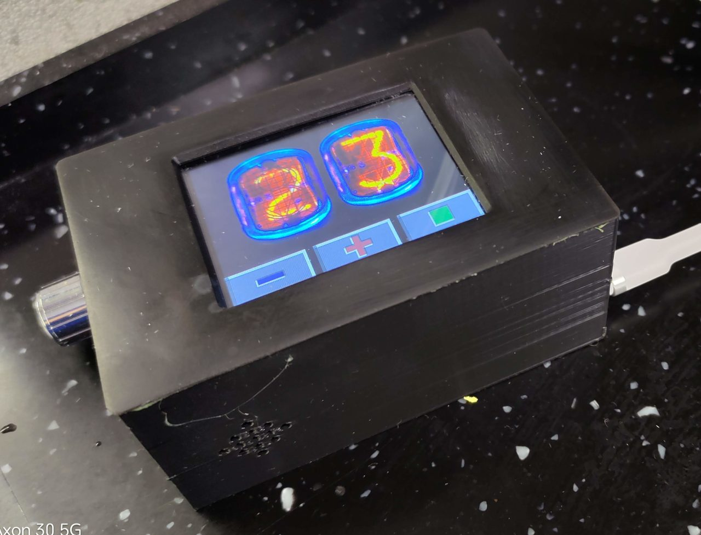

# Пример работы с тачскрином XPT2046, экран 320х240, контроллер ILI9341 - кухонный таймер.
- Таймер позволяет указать интервал от 1 до 99 минут.  
- Настройка экранными кнопками и "тычками" по цифрам.  
- Калибровки тачскрина запоминаются в последней странице EEPROM (если при запуске калибровочных данных в EEPROM не обнаружено - запускается процесс калибровки).  
- Также процесс калибровки можно запустить, если нажать на экран при запуске и удерживать нажатие лболее двух секунд.  
- Звук генерируется на выходах DAC0 и DAC1 в виде смеси "синусоид" с частотами 3.6 и 4.2 кГц (DDS генератор, опорная частота 25 кГц), на двух выходах ЦАП сигнал в противофазе (что позволяет прицепить напрямую высокоомный наушник и проверить звук).  
- Поле запуска таймера возможна корректировка оставшегося времени кнопками "+" и "-", а также отключение счёта кнопкой "старт/стоп".  
- В "дежурном режиме" задействован "скринсэйвер" - летающий по экрану (чёрный фон) квадратик меняющегося цвета.  
- При завершении счёта кроме звукового сигнала на экране отображается анимация "звонящего будильника".  
- Устройство реализовано в виде готового изделия на основе модуля ELSOMIC SE.  


***

## Подключение экрана:
- LED   PORT1.0
- SCK   PORT1.2 (SCK1)
- SDA   PORT1.1 (MOSI1)
- DC    PORT1.9
- RESET PORT1.8
- CS    PORT1.5

## Подключение тачскрина:
- SCK    PORT0.2
- MOSI   PORT0.1
- CS     PORT0.8
- MISO   PORT0.0
- PENIRQ PORT0.10

## Ещё заняты:
- NSS   PORT0.3 (NSS0_IN) - к тачскрину не подключен.
- NSS   PORT1.3 (NSS1_IN) - к экрану не подключен.

***

## Сборка
```
make
```

## Заливка
```
make upload
```

## Если не установлен загрузчик из примера ../ex_loader_2, тогда так, но ждать долго придётся :)
```
python3 ../tools/elbear_uploader.py ./out.hex --com /dev/ttyUSB0
```
