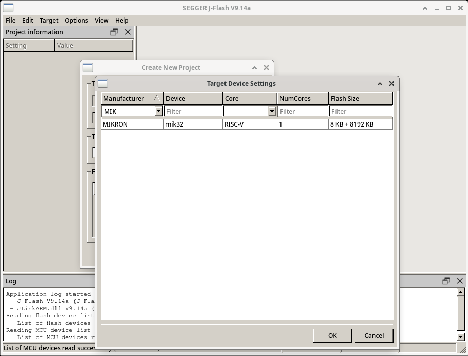

# Пример работы с J-Link от SEGGER.
- Проверялось на JFlash, работает как с основным флэшем, так и с NVR.
- [Описание "загрузчика" флэша для J-Link](ttps://kb.segger.com/SEGGER_Flash_Loader)
- [Описание добавления нового "устройства" для J-Link](https://kb.segger.com/J-Link_Device_Support_Kit)
- Для того, чтобы MIK32 появился в списке устройств J-Link, нужно скопировать файлы **mik32.xml**, **mik32_spiflash_EEPROM.elf**, **mik32_spiflash_W25Q64JV.elf** и **mik32_spiflash_PY25Q128HA.elf** в директорий $\{HOME\}/.config/SEGGER/JLinkDevices/MIKRON/mik32/ (должен быть установлен пакет SEGGER'овского софта J-Link).
- 
- Для других микросхем SPI FLASH пишите другие загрузчики :)

## Сборка загрузчиков
```
make
```
